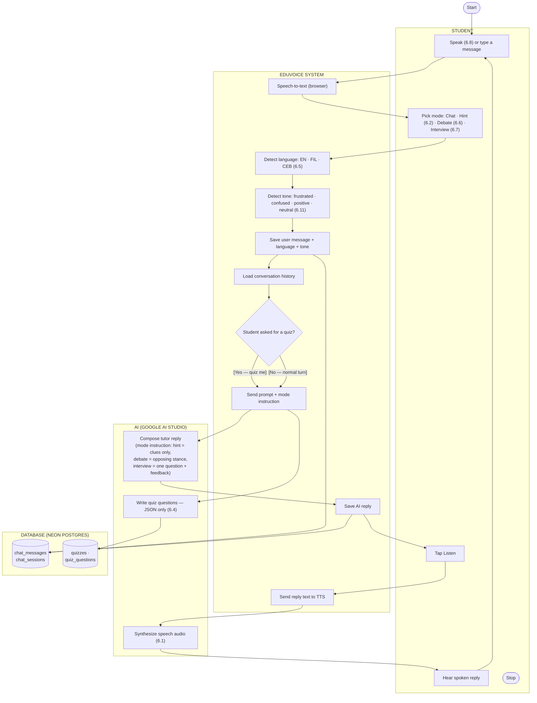
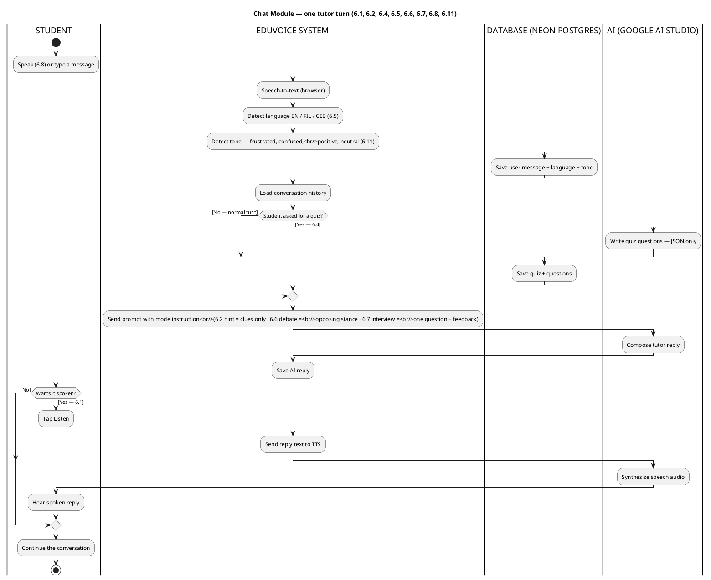
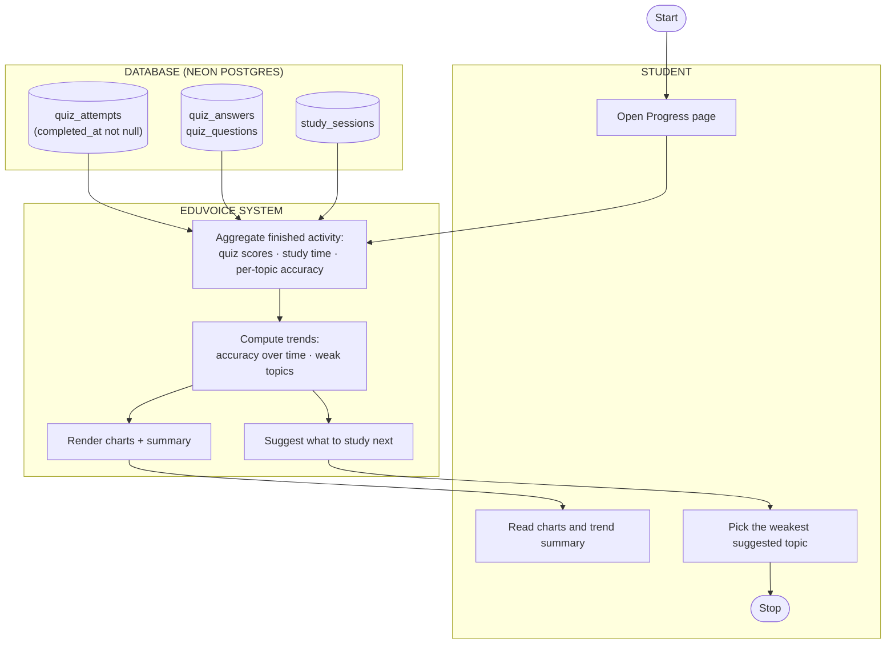
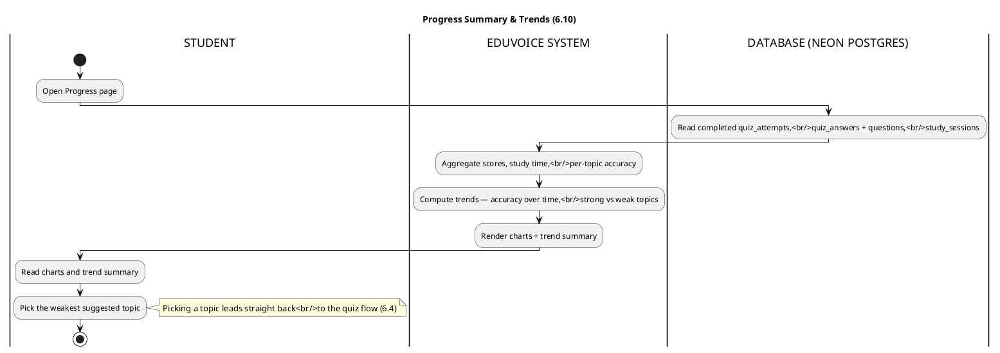
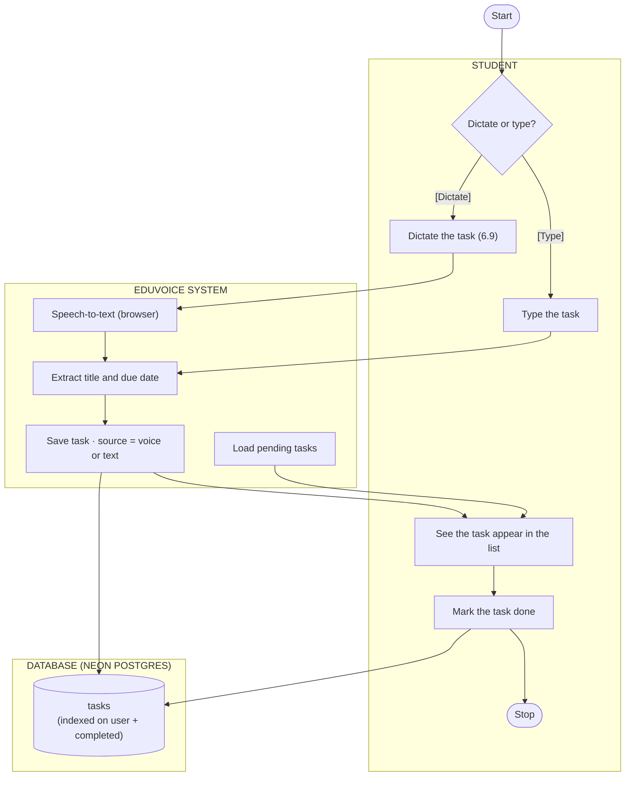
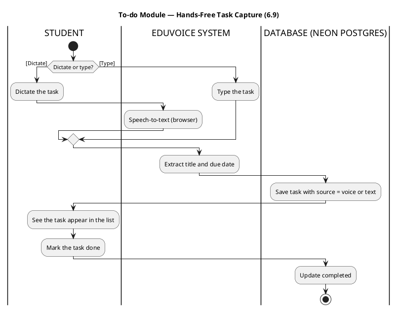
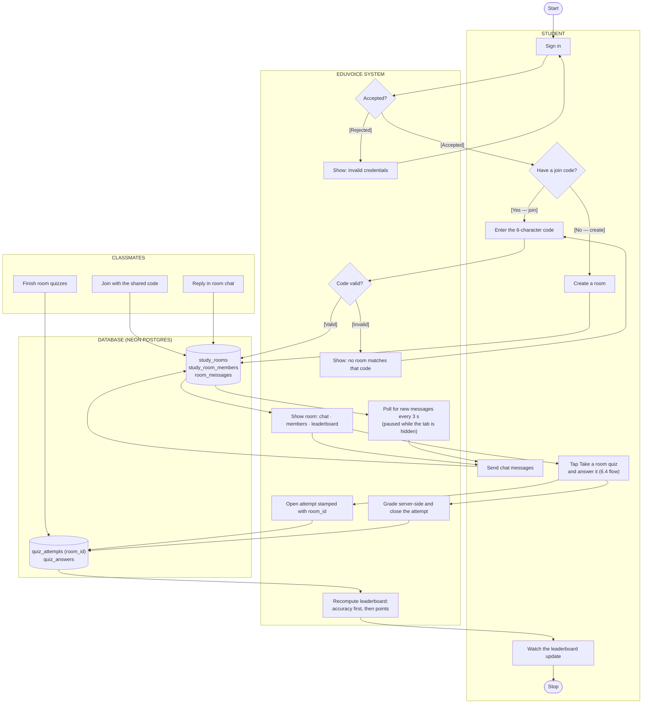
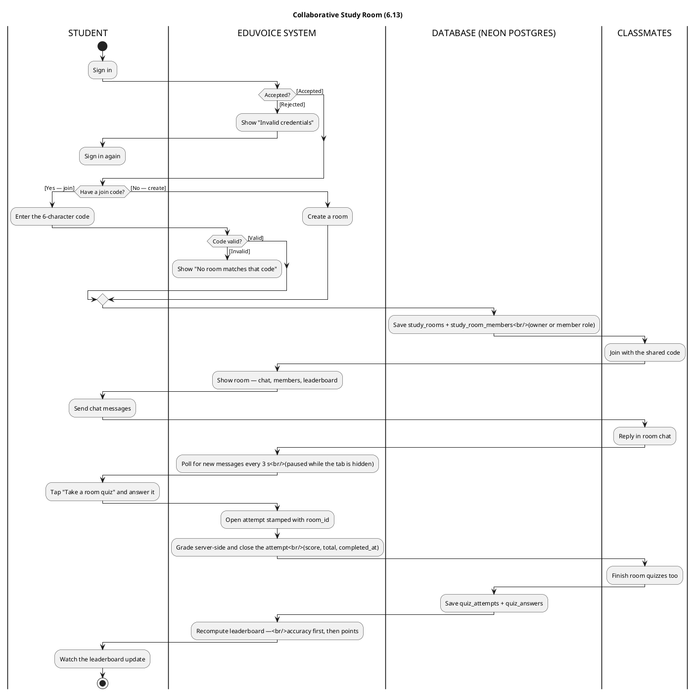

# EduVoice — Activity Diagrams (WITH PARTITION)

With-partition (swimlane) activity diagrams for EduVoice's four modules, drawn
in the same notation as the whiteboard example: **partitions** as vertical
lanes, **actions** as boxes, **decisions** as diamonds, and **guards** in
brackets — `[Accepted]`, `[Rejected]`.

Each module's lanes are cut from the same set:

| Partition | Meaning |
| --- | --- |
| **STUDENT** | What the user does (equivalent of the whiteboard's TEACHER lane) |
| **CLASSMATES** | Other students in a shared room (study-room module only) |
| **EDUVOICE SYSTEM** | Next.js server actions — validation, detection, grading, orchestration |
| **AI (GOOGLE AI STUDIO)** | Gemini — replies, quiz writing, spoken audio (rotating free-tier keys) |
| **DATABASE (NEON POSTGRES)** | Postgres tables via Drizzle |

Every diagram reflects the code as implemented (`src/features/*`); the one
exception is noted in the Progress module, whose page is still a placeholder
but whose tables and queries are designed and partly exercised.

## Module map

| Module | Features covered | Lanes used |
| --- | --- | --- |
| 1. Chat | 6.1 TTS AI response · 6.2 Hint Mode · 6.4 Quiz generation · 6.5 Language detection · 6.6 Debate Mode · 6.7 Interview Mode · 6.8 Voice-based conversation · 6.11 Tone & Mood Detector | STUDENT · SYSTEM · AI · DATABASE |
| 2. Progress Summary & Trends | 6.10 Progress Visualization | STUDENT · SYSTEM · DATABASE |
| 3. To-do | 6.9 Hands-Free Task Capture | STUDENT · SYSTEM · DATABASE |
| 4. Collaborative Study Room | 6.13 Collaborative Study Rooms | STUDENT · CLASSMATES · SYSTEM · DATABASE |

---

## 1. Chat Module

Covers: 6.1 TTS AI response · 6.2 Hint Mode · 6.4 Quiz generation · 6.5
Language detection · 6.6 Debate Mode · 6.7 Interview Mode · 6.8 Voice-based
conversation · 6.11 Tone & Mood Detector.

One spoken-or-typed turn, showing where each feature fires: language is
detected on entry (6.5), tone right after it (6.11), the mode pick switches the
AI's instruction (6.2/6.6/6.7), a quiz request branches to JSON generation
(6.4), and the reply can be spoken back (6.1).

### Mermaid

### PlantUML

**Database touchpoints:** `chat_sessions` (mode, language, title) ·
`chat_messages` (role, content, language, tone, provider) · `quizzes` +
`quiz_questions` when a quiz request branches (6.4).

---

## 2. Progress Summary & Trends Module

Covers: 6.10 Progress Visualization and Summary Trends.

Aggregates finished work into charts and trends, then closes the loop by
pointing the student at their weakest topic. Note: the tables, aggregates, and
index design below exist in the schema and were exercised against the database;
the charts page itself is still a `ComingSoon` placeholder, so this diagram is
the designed flow.

### Mermaid

### PlantUML

**Database touchpoints:** `quiz_attempts` (indexed on `user_id, completed_at`)
· `quiz_answers` + `quiz_questions` (per-topic correctness) · `study_sessions`
(activity type, topic, duration).

---

## 3. To-do Module

Covers: 6.9 Hands-Free Task Capture.

The hands-free path: dictate a task, the system transcribes and stores it with
`source = voice`; typed entry follows the same path with `source = text`.

### Mermaid

### PlantUML

**Database touchpoints:** `tasks` (title, description, `due_date`, `completed`,
`source` enum `voice | text`, indexed on `user_id, completed`).

---

## 4. Collaborative Study Room Module

Covers: 6.13 Collaborative Study Rooms.

The full room lifecycle with a CLASSMATES lane, because the module is
meaningless without other people: rooms are created and joined by code, chat is
polled live, and every finished quiz stamped with the room's `room_id` lands on
the shared leaderboard.

### Mermaid

### PlantUML

**Database touchpoints:** `study_rooms` (unique `join_code`, optional shared
`document_id`) · `study_room_members` (role enum, unique per room + user) ·
`room_messages` (polled chat) · `quiz_attempts.room_id` — the column that ties
a score to a room — plus `quiz_answers`.

---

## Cross-module notes

- **Sign-in is shared.** Every module starts behind Clerk authentication; the
  `[Accepted] / [Rejected]` loop is drawn in full only in module 4.
- **Feature 6.4 appears twice by design.** Generation lives in the Chat module
  (per the module breakdown), and the Study Room module reuses it for
  room-attributed quizzes — the attempt's `room_id` is the hand-off between the
  two.
- **Features 6.3 (document Q&A), 6.12 (flashcards), 6.14 (voice navigation) and
  6.15 (adaptive planner) are out of scope here** — they belong to the
  documents, flashcards, and planner modules, which are not in this breakdown.
